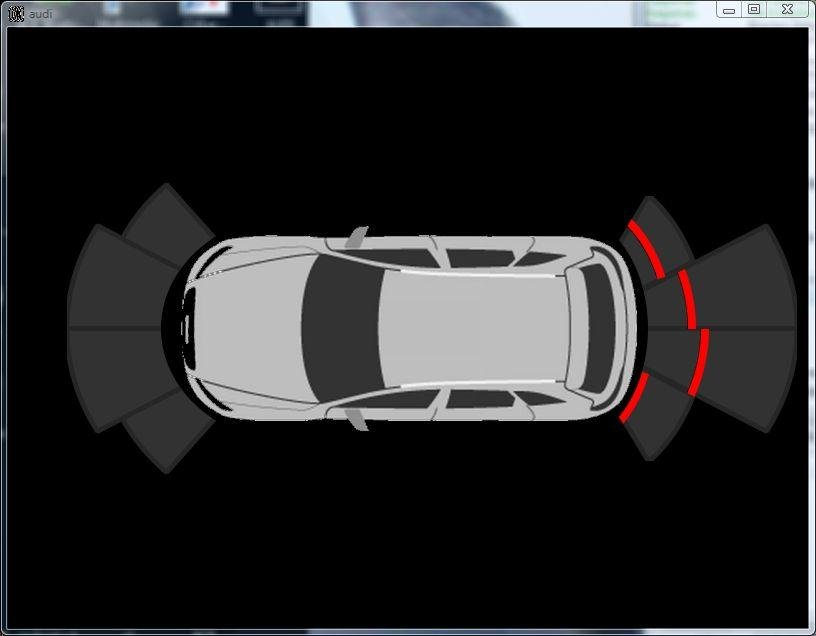
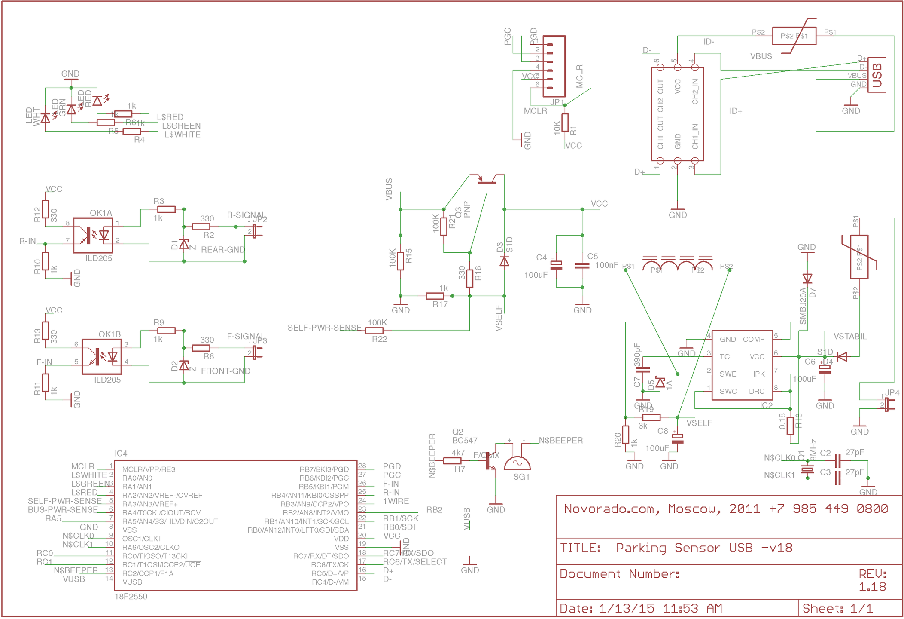
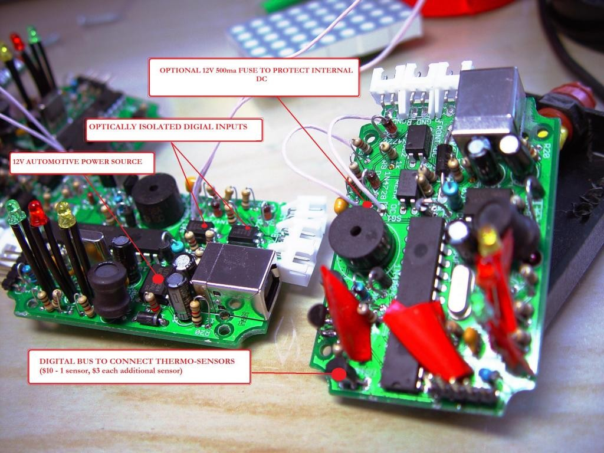
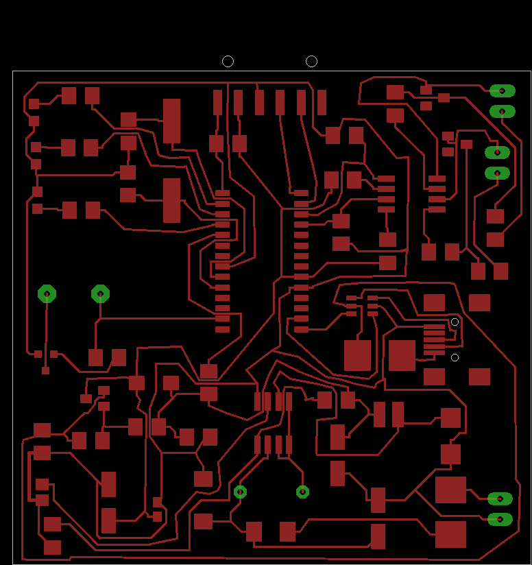

# USBPark / Parktronic

Legacy USB parking-assist software + PCB design files for a real shipped product.

This project was originally a commercial product sold to **a few hundred customers**.  
It is now released publicly to support existing customer installations, maintenance, and long-term serviceability.

Initial project funding was provided by Petroff Air, a luxury business-jet operator, which sought customization and updates for its Q8 fleet using custom embedded car computers.



## At a glance

- Desktop parking-assist software (`parktronic` and `audi`) built with Qt/C++.
- Hardware design files in Eagle format (`.sch`, `.brd`) in [`pcb/`](pcb/).
- PIC18 firmware source is included in [`firmware/`](firmware/).
- PIC18F-based controller design (PIC18F2550 appears in the v18 schematic/board design).
- Firmware update flow is integrated in the desktop app stack.

## Hardware

The latest schematic preview is included below:



Available PCB design assets:

- `pcb/Parking Sensor USB -v18.sch`
- `pcb/Parking Sensor USB -v18.brd`
- `pcb/Parking Sensor USB -v17b.sch`
- `pcb/Parking Sensor USB -v17b.brd`
- `pcb/v18-schematic.webp`

## Production and DIY artifacts

These files capture both ends of the hardware lifecycle: final production output and practical home-lab support tooling.

<table>
  <tr>
    <td align="center" width="50%">
      
      <br />
      <em>v17b production batch: last commercially manufactured board run.</em>
    </td>
    <td align="center" width="50%">
      
      <br />
      <em>v18 iron mask: single-metal DIY transfer mask for home ironing workflow.</em>
    </td>
  </tr>
</table>

## Software components

### `parktronic/`

Main desktop application and diagnostics/configuration UI.

- Qt project: `parktronic/parktronic.pro`
- GUI tabs for diagnostics, firmware update, sounds, webcam, and settings
- Firmware resources referenced by the build (`hex/firmware.qrc`)
- Platform-specific entry points (`linux.cpp`, `win32.cpp`)

### `audi/`

Alternate/variant desktop UI package for the same product family.

- Qt project: `audi/audi.pro`
- Vehicle-oriented UI assets and sound notifications

### `firmware/`

PIC18 USB firmware source for the controller device.

- Main firmware entrypoint: `firmware/main.c`
- USB stack integration: `firmware/usb_device.c`, `firmware/usb_function_generic.c`, `firmware/usb_descriptors.c`, `firmware/usb_config.h`
- Version metadata: `firmware/version.h` (`VERSION_STRING "2.0.3"`)
- Linker scripts for PIC18F2550 variants:
  - `firmware/18F2550_NO_BOOTLOADER.lkr`
  - `firmware/rm18f2550_HID_Bootload.lkr`
- Protocol/sensor support files include I2C and DS1820 helpers plus line-decoding logic (`challenger26.*`, `i2c.*`, `ds1820.h`)

## PIC18F firmware context

This project includes a PIC18F USB-controller hardware design and host-side firmware update integration:

- Schematic/board reference to PIC18F2550 in `pcb/Parking Sensor USB -v18.sch` and `.brd`
- Host software contains firmware version/update handling paths
- Firmware source tree now included directly under `firmware/`
- Firmware code references legacy Microchip USB stack/C18 toolchain headers and bootloader settings (`../Bootloader/src/settings.h`)

## Build notes (legacy)

This is a legacy codebase (Qt4-era project files and platform-specific dependencies).

Typical flow:

```bash
cd parktronic
qmake parktronic.pro
make
```

and similarly for:

```bash
cd audi
qmake audi.pro
make
```

Notes:

- The original environment references external/internal Novorado libraries and SDK paths.
- You may need to adapt include/library paths before successful local builds.
- Firmware sources are legacy PIC18/Microchip C18-era code and may require restoring the original Microchip USB stack layout/toolchain paths to build as-is.

## Why this repo is public

The code and hardware design are published to keep deployed units supportable for existing users:

- preserve serviceability
- enable repairs and compatibility work
- allow community maintenance of legacy installations

## Repository layout

```text
usbpark-code/
├── audi/         # Variant desktop app (Qt/C++)
├── firmware/     # PIC18F2550 USB firmware source
├── parktronic/   # Main desktop app + diagnostics + firmware update UI
├── pcb/          # Eagle schematic/board files + schematic image
├── v17b-batch.jpg
├── v18-iron-mask.png
└── audi.jpeg     # Demo product image
```

## License and reuse

- `pcb/LICENSE` currently contains an MIT license text for PCB artifacts.
- Project history: originally commercial; now made public to support the installed base.
- If you need strict legal classification for reuse (public domain vs MIT-only subsets), document it explicitly for your distribution before shipping derivatives.
